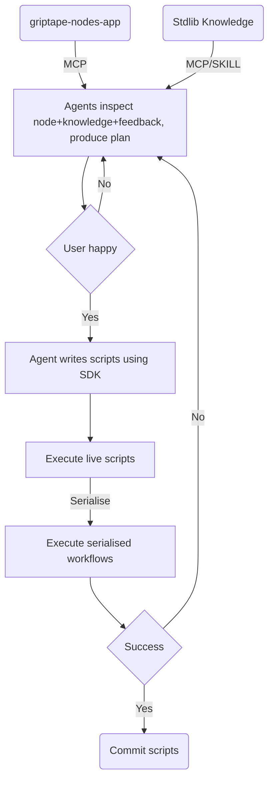

# griptape-nodes-e2e

## Agent-augmented scripting



## Development

### Prerequisites

Integration tests make use of git submodules of nodes libraries

```bash
git submodule update --init --recursive
```

Building the `griptape-nodes-app` package requires a public key for the license server. We do not
use licensing in this project, so can use a dummy key, e.g.

```bash
export GRIPTAPE_NODES_LICENSE_SERVER_PUBLIC_KEY=LS0tLS1CRUdJTiBQVUJMSUMgS0VZLS0tLS0KTUNvd0JRWURLMlZ3QXlFQWdreTRWVHc2b05lZmdSTHFsNm5uTnNlS1R0c295UHlMS1NkazV4anNGTjg9Ci0tLS0tRU5EIFBVQkxJQyBLRVktLS0tLQo=
uv sync --dev
```

> Note: this will not be necessary once Python wheels are available for the `griptape-nodes-app`
> package.

# Notes

- Agent generates plan before doing anything
  - another agent approves
    - Multiple specialists
  - user approves
  - otherwise iterate
- Consider Wiki Builder alongside SKILL.md
  - Or even special Reactor knowledge graph
  - Knowledge graph stores node library metadata
  - Required to determine appropriate auxiliary nodes to connect for testing
- For manual testing, expose parameters on a Start Flow, to try with different inputs or allow
  supplying local file paths, etc.
